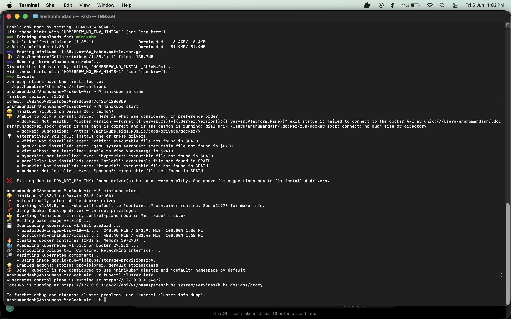
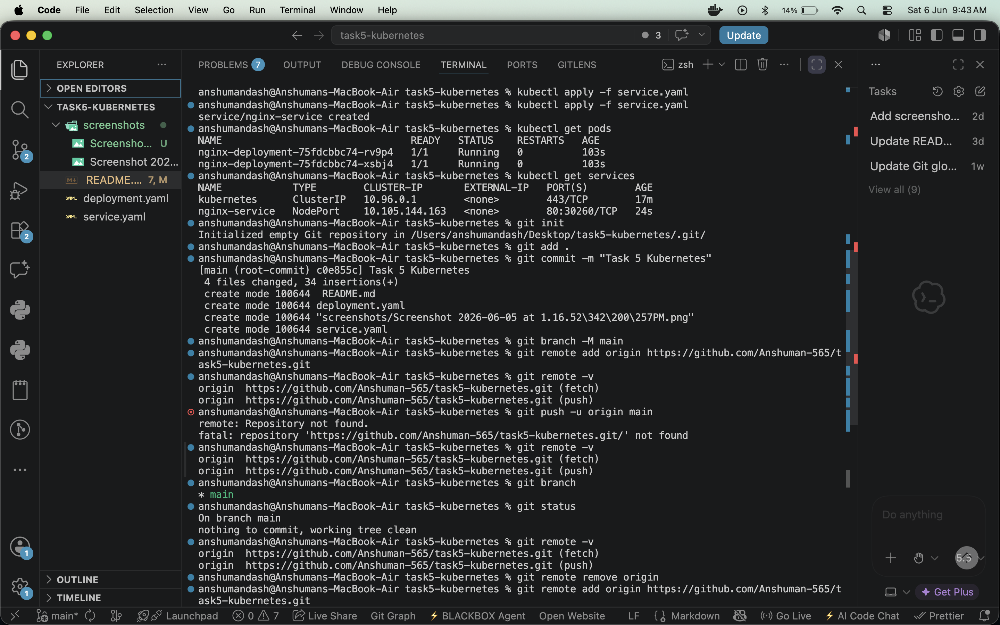
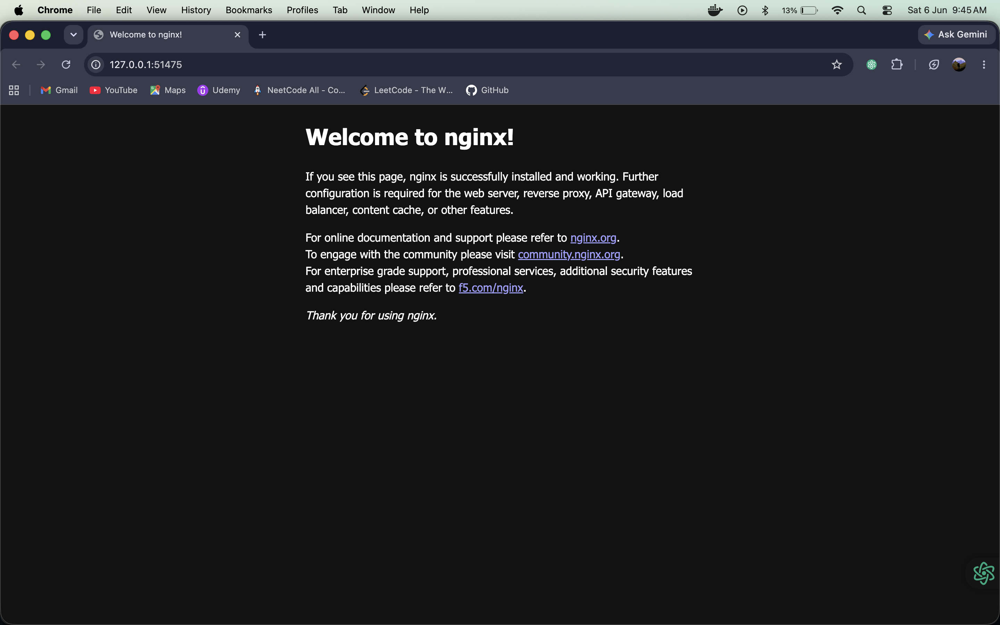
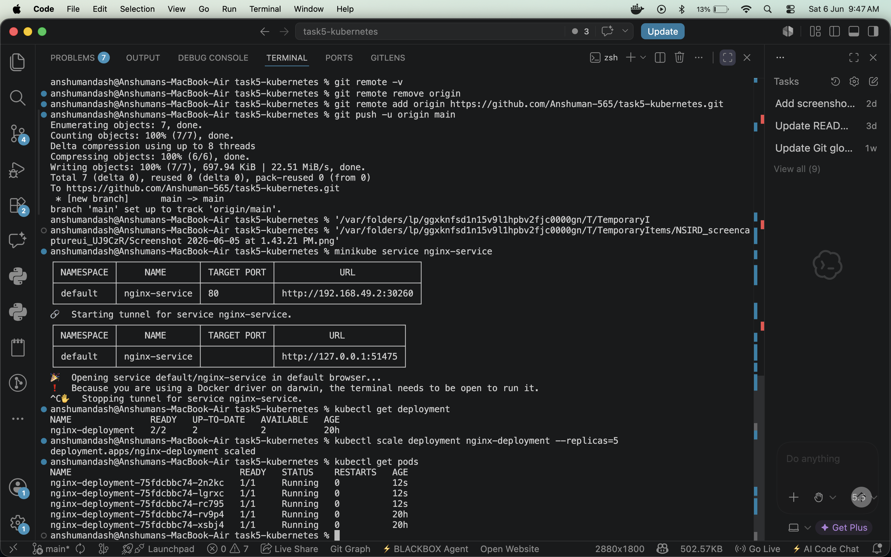
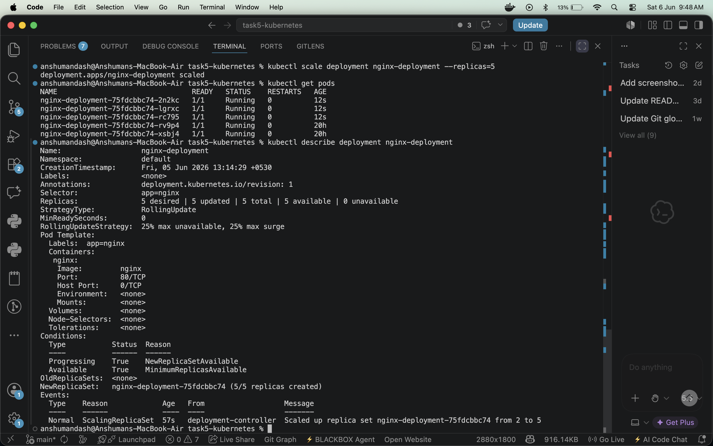

# Kubernetes Minikube Task

This project demonstrates how to create a local Kubernetes cluster with Minikube, deploy an Nginx application, expose it with a NodePort service, verify it in the browser, and scale the deployment.

## Objective

Build a Kubernetes cluster locally using Minikube and deploy a working Nginx application.

## Tools Used

- Docker
- Minikube
- kubectl
- Nginx container image

## Project Files

| File | Purpose |
| --- | --- |
| `deployment.yaml` | Creates the `nginx-deployment` Kubernetes Deployment with 2 initial replicas. |
| `service.yaml` | Exposes the Nginx pods through the `nginx-service` NodePort service. |
| `screenshots/` | Contains proof screenshots for setup, deployment, service access, scaling, and verification. |

## Kubernetes Configuration

### Deployment

The deployment creates Nginx pods using the official `nginx` image and exposes container port `80`.

```yaml
apiVersion: apps/v1
kind: Deployment
metadata:
  name: nginx-deployment
spec:
  replicas: 2
  selector:
    matchLabels:
      app: nginx
  template:
    metadata:
      labels:
        app: nginx
    spec:
      containers:
      - name: nginx
        image: nginx
        ports:
        - containerPort: 80
```

### Service

The service selects pods with the `app: nginx` label and exposes them through a NodePort.

```yaml
apiVersion: v1
kind: Service
metadata:
  name: nginx-service
spec:
  selector:
    app: nginx
  ports:
  - port: 80
    targetPort: 80
  type: NodePort
```

## Commands Used

Start the local Minikube cluster:

```bash
minikube start
```

Apply the Kubernetes deployment:

```bash
kubectl apply -f deployment.yaml
```

Apply the Kubernetes service:

```bash
kubectl apply -f service.yaml
```

Check running pods:

```bash
kubectl get pods
```

Check services:

```bash
kubectl get services
```

Open the Nginx service in the browser:

```bash
minikube service nginx-service
```

Scale the deployment from 2 replicas to 5 replicas:

```bash
kubectl scale deployment nginx-deployment --replicas=5
```

Verify deployment details:

```bash
kubectl describe deployment nginx-deployment
```

## Screenshot Walkthrough

### 1. Minikube Installation and Cluster Startup

This screenshot shows Minikube installed, the first start attempt failing because Docker was not ready, then Minikube starting successfully after Docker became available. It also shows `kubectl cluster-info` confirming that the Kubernetes control plane is running.



### 2. Service Creation, Pods, and NodePort

This screenshot shows `kubectl apply -f service.yaml`, `kubectl get pods`, and `kubectl get services`. The Nginx pods are running and `nginx-service` is exposed as a NodePort service.



### 3. Application Running in Browser

This screenshot confirms the NodePort service successfully opens the default Nginx welcome page in the browser.



### 4. Service URL and Scaling

This screenshot shows `minikube service nginx-service` generating a local service URL, followed by the deployment being scaled to 5 replicas. The `kubectl get pods` output confirms all 5 Nginx pods are running.



### 5. Deployment Description After Scaling

This screenshot shows `kubectl describe deployment nginx-deployment`, confirming the deployment has 5 desired, updated, total, and available replicas.



## Final Outcome

- Minikube cluster was created locally.
- Nginx was deployed using Kubernetes manifests.
- The application was exposed with a NodePort service.
- The service was opened successfully in the browser.
- The deployment was scaled from 2 replicas to 5 replicas.
- Kubernetes deployment details confirmed all replicas were available.
